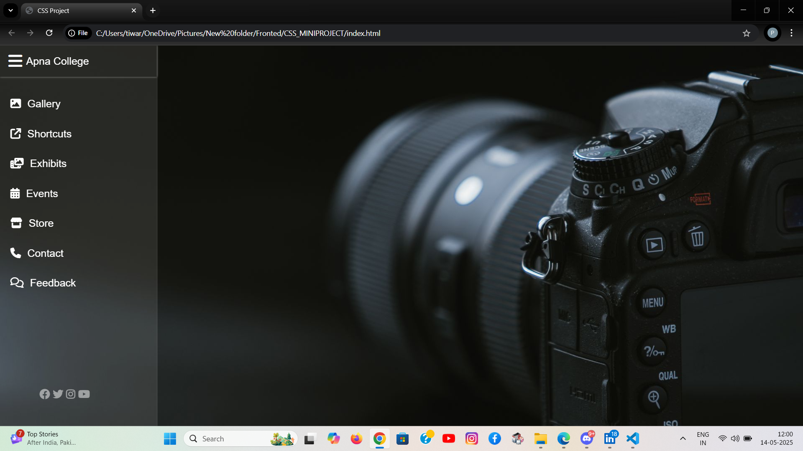

# CSS_MINIPROJECT

## Description
This project is a simple web page with a responsive CSS-based sliding menu. This menu is triggered by a checkbox and features smooth transitions for a polished user experience. It includes a clean layout, a logo, and social media links.

## Demo
Page before opening the menu

Page after opening the menu

## Installation
- Clone the repository: git clone [https://github.com/your-username/your-repository.git](https://github.com/your-username/your-repository.git)
- Open the project folder: cd your-repository
- Open the HTML file in your browser.

## Usage
To seamlessly incorporate the CSS-based sliding menu into your web project, start by including the necessary styles and Font Awesome icons in your HTML file's <head> section. Then, integrate the provided HTML structure within your <body>, ensuring to tailor the content inside the .sidebar_menu div to your project's specifications. Optionally, tweak the CSS styles in the style.css file to align with your project's design preferences. Once completed, open your HTML file in a web browser, where the sliding menu will be activated by clicking the designated icon, offering a user-friendly navigation experience. This straightforward integration allows you to enhance your web application's functionality with a responsive and visually appealing sliding menu.

## Contributing
If you'd like to contribute to this project, please follow these steps:

- Fork the repository.
- Create a new branch: git checkout -b feature/new-feature.
- Make your changes and commit them: git commit -m 'Add new feature'.
- Push to the branch: git push origin feature/new-feature.
- Submit a pull request.

